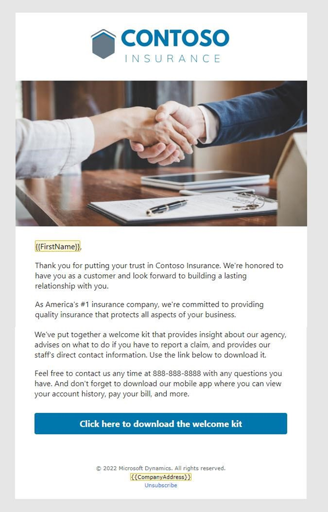
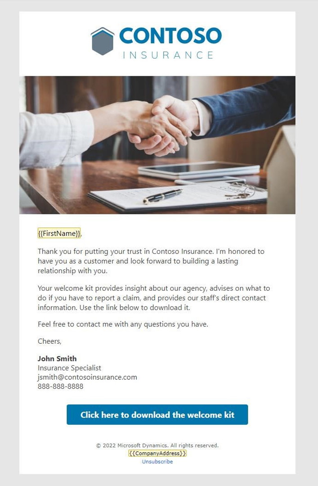

---
lab:
  title: 'Laboratório 1: Criar emails'
---

## Laboratório 1: Criar emails 

Neste laboratório, você aprenderá a:
- Criar emails para usar em uma jornada
- Usar ativos carregados em um email
- Verificar o conteúdo do seu email e enviar

### Tarefa 1: Criar o primeiro email
1. Faça logon no Dynamics 365 Customer Insights - Journeys.

1. Navegue até a área de trabalho **Jornadas em tempo real**.

1. Em Canais, selecione **Emails**.

1. Crie o email.
   - Clique em **+ Novo** para criar um email.
   - Na galeria de modelos, selecione **Ignorar**.

1. Insira os detalhes sobre o email.
   - Nome: Email de boas-vindas 1
   - Assunto: Boas-vindas à Contoso Insurance
   - Visualizar texto: Estamos comprometidos em fornecer a você um seguro de qualidade.

1. Selecione o perfil de marca padrão como o perfil de marca.

1. Navegue até **Configurações** e expanda **Conformidade**. Certifique-se de que Finalidade esteja definida como **Comercial.**

1. Criar o email. Consulte a captura de tela do Email de boas-vindas 1 abaixo para ver ideias de design e conteúdo, usando a imagem de destaque que você carregou nas instruções de configuração. Você pode modificar as imagens e o conteúdo conforme desejado, mas convém incluir um botão de chamada para ação neste email, pois ele será usado como critério de ramificação na jornada.

 

1. Esta é uma cópia de amostra deste email. Você pode copiar e colá-la no design do seu email. Use a **Personalização** para inserir conteúdo dinâmico para o primeiro nome do contato. 

    ```
    {{FirstName}},
    
    Thank you for putting your trust in Contoso Insurance. We're honored to have you as a customer and look forward to building a lasting relationship with you. 
 
    As America's \#1 insurance company, we're committed to providing quality insurance that protects all aspects of your business. 
 
    We've put together a welcome kit that provides insight about our agency, advises on what to do if you need to report a claim, and provides our staff's direct contact information. Use the link below to download it. 
 
    Feel free to contact us any time at 888-888-8888 with any questions you have. And don't forget to download our mobile app where you can view your account history, pay your bill, and more. 
    ```

1. Adicionar um botão no email. 

    - Na Caixa de Ferramentas, selecione a guia **Elementos**. 
    - Arraste um botão abaixo do texto principal. 
    - Altere o URL para contoso.com. 
    - Expanda a seção Estilo. 
    - Altere a cor do botão para #0076ad. 

1.  Visualize, teste e envie o email. 

    - Navegue até a guia **Visualizar e testar** do seu email para revisá-lo. 
    - Use **Testar envio** para enviar uma cópia para si mesmo. Digite seu endereço de email pessoal. Selecione o contato que você criou anteriormente - a personalização preencherá o primeiro nome desse contato. Se o email não estiver na caixa de entrada, verifique a pasta de lixo eletrônico. 
    - Faça as alterações finais. 
    - Clique em **Verificar conteúdo**. Corrija os erros, se necessário. 
    - Clique em **Pronto para enviar**. 

### Tarefa 2: Criar o segundo email
Criaremos mais dois emails copiando o email que você acabou de criar.

1. Com o Email de boas-vindas 1 aberto, clique no menu suspenso ao lado de **Salvar** e clique em **Salvar como**.

1. Atualize o nome do email para **E-mail de boas-vindas 2**. 

1. Clique em **Salvar e Fechar**.

1. Selecione **Exibir registro** no pop-up para ir para o email recém-criado. (Se não aparecer, vá para **Emails** e selecione **Email de boas-vindas 2.**)

1. Altere o assunto e visualize o texto.
    - Sugestão de **Assunto:** Obtenha acesso sob demanda ao portal da Contoso Insurance.
    - Sugestão de **Texto de visualização**: revise as informações da conta, os detalhes da política, envie uma declaração e muito mais.

1. Criar o email. Consulte a captura de tela do Email de boas-vindas 2 abaixo para ver ideias de design e conteúdo. Você pode modificar as imagens e o conteúdo conforme desejado. 

 

1. Esta é uma cópia de amostra deste email. Você pode copiar e colá-la no design do seu email. (Observação: recomendamos deixar o FirstName do primeiro email e substituir o restante da cópia por este.) 

    ```
    I would like to welcome you to the Contoso family! Our specialists are here to help you with all your insurance needs. We also encourage you to setup your Contoso Insurance online account to gain 24/7 access to:  
        -   Your account information and policy details. 
        -   Submit a request for coverage verification, start a claim, or review prior claims. 
        -   A secure and encrypted internal messaging tool for sharing sensitive information. 
    Feel free to contact me with any questions you have. 
        
    Cheers, 
    John Smith, Insurance Specialist   jsmith@contosoinsurance.com 
    888-888-8888 

1. Preview, test, and go live with your email.

### Task 3: Create your third email
We will create one final email by copying email 2.

1. Create a new email by copying email 2. Name the email Welcome email 3. 

1. Enter details about the email.
    - Suggested **Subject:** Welcome to Contoso
    - Suggested **Preview text:** Review your welcome information.

1. Design the email. Refer to the screenshot of Welcome Email 3 below for design and content ideas. You can modify the images and content as desired. 

 

1. Here is sample copy for this email. You can copy and paste this into your email design. (Note: We recommend leaving FirstName from the first email and then replacing the rest of the copy with this.) 

    ```
    Agradecemos a confiança na Contoso Insurance. É uma honra para nós ter você como cliente e estamos animados para construir uma relação duradoura com você. Seu kit de boas-vindas fornece informações sobre nossa agência, conselhos sobre o que fazer se você precisar relatar uma reclamação e informações de contato direto de nossa equipe. 

    Use o link abaixo para baixar o kit em nosso site.
    
    Caso tenha qualquer dúvida, fique à vontade para entrar em contato comigo. Atenciosamente, John Smith, Especialista em Seguros   jsmith@contosoinsurance.com 888-888-8888 

1. Atualizar o botão no email. No campo de texto** Botão**, altere-o para **Clique aqui para ver o kit de boas-vindas.**

1. Visualize, teste e envie o email.
