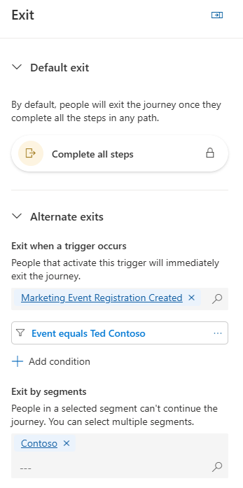

---
lab:
  title: 'Laboratório 3: Criar uma jornada baseada em segmento'
---
## Laboratório 3: Criar uma jornada baseada em segmento 

Neste laboratório, você aprenderá a:
- Criar uma jornada baseada em um segmento 
- Definir critérios de saída para o segmento 

### Tarefa 1: Criar uma jornada baseada em segmento 
A Contoso quer poder interagir com clientes que atendam a critérios demográficos específicos. Para conseguir isso, eles criarão uma jornada baseada em segmento.

1. Em Interação, selecione **Jornadas**.

1. Clique em **+ Nova jornada** na barra de comandos.

1. Selecione **Ignorar e criar do zero**.

1. Em Nomear a jornada, insira **Campanha de Seattle**.

1. Em Escolher tipo de jornada, selecione **Baseada em segmento**.

1. Em Selecionar um segmento, escolha **Clientes de Seattle**.

1. Em Selecionar a frequência, escolha **Uma jornada que se repete em que todos os membros do público-alvo repetem a jornada a cada:**

1. Selecione **6 semanas**.

1. Defina o fuso horário para o seu fuso horário.

1. Defina a Data de início para a data de hoje, daqui a 30 minutos.

1. Defina a Data de término para cerca de seis meses a partir de hoje.

1. Clique em **Criar**.

1. Nas Configurações da jornada à direita, confirme se a seção **Entrada** está selecionada.

1. Vá para **Excluir por segmentos** e selecione **Clientes empresariais**.

### Tarefa 2: Definir os critérios de saída da jornada
Como a meta dessa jornada é levar as pessoas a se inscreverem em um evento de marketing, queremos garantir que, uma vez que elas se inscrevam, não importa onde estejam na jornada, a jornada termine para elas.  Além disso, se algum funcionário da Contoso morar em Seattle, queremos que essa pessoa esteja ciente do próximo evento; no entanto, não queremos que ela passe pela jornada em si. Por esse motivo, vamos limitar quem pode continuar a jornada.  

1.  Selecione a seção **Sair**.  

1.  Na seção **Sair quando ocorrer um gatilho**, selecione **Registro de evento de marketing criado**.

1.  Selecione **Adicionar condição**.

1.  Expanda **Registro de evento de marketing criado** e, em seguida, expanda **Referência de evento de marketing**.

1.  Selecione **Evento**.

    

1.  Defina o Operador como **Igual**.

1.  Defina o Valor como **Ted Contoso**.

1. Em **Sair por segmentos**, defina o valor como **Clientes da Contoso**. Seus critérios de saída serão como a imagem abaixo.

    

### Tarefa 3: Construir a jornada
Agora que definimos os diferentes critérios relacionados a essa jornada, vamos criar a jornada em si.  

1. No designer da jornada, clique no ícone de **adição (+)** no bloco Contato criado.

1. Selecione **Ramificação de atributo (ramificação com base em um valor específico).**

1. Em Nome de exibição à direita, nomeie o atributo como **Novo cliente de negócios**.

1. Selecione **Ramificação 1** e em Escolher um atributo, procure **Descrição (descrição)** em **Contato**.

1. Altere o valor de Igual para **Contém**.

1. Em Valor, insira **Negócios**.

1. Clique no **ícone de adição (+)** em Ramificação 1.

1. Selecione **Email: Enviar um email**.

1. Em Selecionar email, escolha **Email de boas-vindas 1.**

1. Clique no **ícone de adição (+)** no bloco Enviar um email.

1. Selecione **Aguardar gatilho**.

1. No painel Ramificação Se/então à direita, em Aguardar por, escolha um tipo de condição de ramificação, selecione **A mensagem anterior recebe uma interação**.

1. Em Escolher uma interação, selecione **Link por email clicado**.

1. Em **Qual é o limite de tempo?**, insira 10 minutos.

1. De volta ao Diagrama da jornada, para especificar o link clicado, selecione **criar ramificações**.

1. Selecione o atributo **Link por email clicado**.

1. Em Ramificação 1, Escolher um link, clique no botão de chamada para ação no email.

1. Abaixo do caminho do botão clicado, clique no **ícone de adição (+)**.

1. Selecione **Enviar um email**.

1. Em Selecionar e-mail, escolha **E-mail de boas-vindas 2**.

1. No caminho correspondente Não, clique no **ícone de adição (+)**.

1. Selecione **Enviar um email**.

1. Em Selecionar email, escolha **E-mail de boas-vindas 3**.

1. Salve a jornada.

1. Revise a jornada. Faça as alterações finais.

1. Clique em **Publicar**. Aguarde a publicação da jornada.

